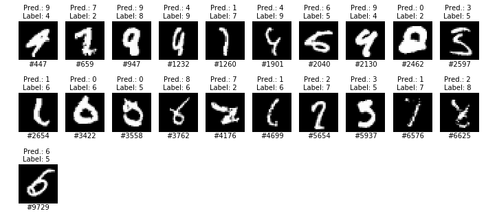

# MNIST digit recognizer
 
## Results of this model on MNIST test data:
1. 0.22% test error rate with ensemble of 10 CNNs
2. 0.21% test error rate with ensemble of 6 selected CNNs
3. 0.26% test error rate for best single model

## Incorrect predictions
0.21% test error rate gives us a total of 21 wrong predictions on the MNIST testing dataset of 10,000 images: 

